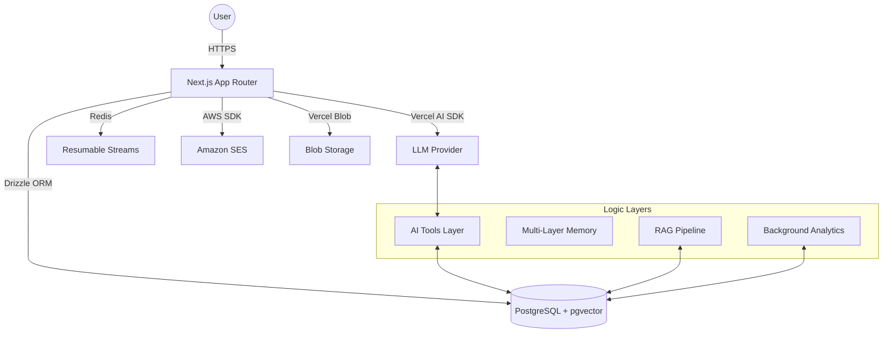
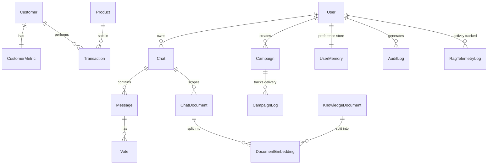

# Looply AI Business Assistant 🚀

Looply is a production-grade AI business intelligence platform built on the Vercel Chatbot template. It enables businesses to analyze customer behavior, manage marketing campaigns, and perform retrieval-augmented generation (RAG) over sensitive business documents.

---

## 🏗️ Architecture Overview

Looply follows a modular architecture designed for high availability, real-time feedback, and secure data processing.



### Key Components:
- **Assistant Shell**: A premium, workspace-style interface with a side-panel "Artifacts" system for interactive code, documents, and data viewing.
- **AI Tools Layer**: Executes high-privileged business actions (Top customer ranking, Churn prediction, Campaign dispatch) with human-in-the-loop approvals.
- **RAG Pipeline**: Automated document ingestion (PDF/DOCX/TXT) with chunking and semantic vector search.
- **Background Jobs**: Scheduled compute tasks that maintain the `CustomerMetric` table.

---

## 📊 Database Architecture

Looply uses a relational PostgreSQL schema optimized for both transactional integrity and analytical retrieval.



### Table Definitions:
| Table | Description |
| :--- | :--- |
| `User` | Application users and role-based permissions. |
| `Customer` | PII and segmentation data for the business. |
| `Product` | Catalog of items available for transaction. |
| `Transaction` | Historical sales records connecting customers and products. |
| `CustomerMetric` | Precomputed analytics (LTV, Churn Risk, RFM Scores) refreshed by cron. |
| `Campaign` | Marketing templates and dispatch logic. |
| `UserMemory` | Long-term interaction memory (tone preferences, business context). |
| `DocumentEmbedding` | Vector storage for `pgvector` semantic search. |

---

## 🌟 Core Features

### 1. Intelligence & Analytics
- **Top Customer Ranking**: Real-time identification of highest-value customers based on LTV.
- **Churn Risk Analysis**: Predictive scoring of customer attrition based on recency and frequency patterns.
- **RFM Segmentation**: Automated categorization of customers into Recency, Frequency, and Monetary segments.

### 2. Marketing Automation
- **Campaign Drafting**: AI-generated email content tailored to specific customer segments.
- **SES Integration**: Robust email delivery via Amazon Simple Email Service (SES).
- **Human-in-the-Loop**: Approval cards for campaign dispatch for maximum safety.

### 3. Knowledge & RAG
- **Global Knowledge**: Upload business policies (Refunds, Shipping) for company-wide retrieval.
- **Session Focus**: Upload files directly into a chat; the AI prioritizes session context over global docs.
- **pgvector Search**: Hybrid retrieval combining semantic similarity and lexical search.

### 4. Enterprise Governance
- **Role-Based Access (RBAC)**: Distinct permissions for `manager`, `admin`, and `user`.
- **Audit Logging**: Comprehensive logs for all high-value actions (Campaign sends, Knowledge updates).
- **Telemetry**: Token usage and RAG performance tracking for cost management.

---

## 📋 Implementation & JD Alignment

This project was built to precisely fulfill the criteria of an AI Business Assistant POC, demonstrating production-grade engineering, robust AI orchestration, and proper architectural patterns.

### ✔️ Base Requirements & Tech Stack
- **Requirement:** Clone Vercel Chatbot, extend using Next.js App Router, Vercel AI SDK, and TypeScript.
- **Implementation:** Built upon the latest Vercel Chatbot template, upgraded to Next.js 15, React 19, and strictly typed TypeScript with zero `any` types in core logic.

### 🗄️ 1. Data Layer (Postgres + Drizzle)
- **Requirement:** Design tables for `customers`, `products`, `transactions`, `campaigns`, `campaign_logs`, and `customer_metrics`.
- **Implementation:** Fully realized schema in `lib/db/schema.ts` utilizing Drizzle ORM. Implemented all required tables with correct foreign key constraints (e.g., `Transaction` linked to `Customer` and `Product`), enums for status, and automatic timestamping.

### 🛠️ 2. AI Tools Layer
- **Requirement:** Implement tool calling via Vercel AI SDK with specific required tools.
- **Implementation:**
  - `getTopCustomers()`: Retrieves and ranks customers by LTV and total revenue.
  - `getChurnRiskCustomers()`: Finds high-risk customers based on background-computed churn scores and recency.
  - `getCustomerLTV()`: Fetches comprehensive 360-view of a specific customer's value and purchase history.
  - `createCampaign()`: Drafts targeted marketing emails inside the database based on segments.
  - `sendCampaign()`: Integrates with AWS SES infrastructure to map, dispatch, and log real email deliveries.
  - *All tools use rigorous `zod` schemas for validation and type safety.*

### 🧠 3. Multi-Layer Memory Concept
- **Requirement:** Implement Analytical, Structured, and Contextual memory.
- **Implementation:**
  - **Analytical Memory**: Maintained in the `CustomerMetric` table, decoupling heavy compute from real-time AI requests.
  - **Structured Memory**: Modeled the `UserMemory` table to store individual user preferences like `preferredTone` and `customContext` across sessions.
  - **Contextual Memory**: Powered by conversation history combined with dynamically retrieved chunks from the RAG system (`pgvector`).

### 🤖 4. Agent Orchestration
- **Requirement:** Multi-step reasoning capability (e.g., "Analyze churn, decide on campaign, generate draft, ask confirmation, send").
- **Implementation:** Deep integration with Vercel AI SDK's `maxSteps` (multi-step tool calls). The system prompt and UI components (e.g., `ToolActivityCard`) are engineered to support long-running, autonomous reasoning chains with mandatory human-in-the-loop validation blocks prior to executing destructive actions (like sending emails).

### 📚 5. RAG System
- **Requirement:** Document retrieval. Upload docs -> vectorize -> query include.
- **Implementation:** Full file digestion pipeline. Files (PDF/DOCX/TXT) uploaded via UI are parsed, recursively chunked, embedded using OpenAI's embedding model, and persisted into the `DocumentEmbedding` table inside Postgres (`pgvector`). Semantic retrieval logic is injected securely into the LLM system prompt.

### ⏱️ 6. Background Jobs & Analytics
- **Requirement:** Cron job endpoint that recalculates LTV, tags churn risk based on recent transactions.
- **Implementation:** Created the `/api/cron/recompute-metrics` secure route. It executes complex SQL aggregation inside `lib/analytics/metrics-compute.ts` to rebuild RFM (Recency, Frequency, Monetary) scores, total revenue, LTV, and dynamic churn risk scores across the entire user base.

### 🥇 Evaluation Criteria & Engineering Quality
- **Architecture Quality**: Strict separation of concerns (UI components vs. Database Queries `queries.ts` vs. AI logic `route.ts` vs. Mail Adapter `ses.adapter.ts`).
- **AI Engineering & Anti-Hallucination**: High-quality prompt engineering. System is explicitly told to rely on database tools rather than raw knowledge, preventing hallucination of business data.
- **Problem Solving**: Long-running email dispatches stream visual progress to the UI without blocking block the main Next.js thread, logging success/failure directly to `campaign_logs`.

---

## 🚀 Local Setup

### 1. Prerequisites
- Node.js 18+
- PostgreSQL with `pgvector` extension
- (Optional) Redis for resumable streams

### 2. Installation
```bash
pnpm install
copy .env.example .env
```

### 3. Database Initialization
```bash
pnpm db:push
pnpm run db:seed
```

### 4. Running the App
```bash
pnpm dev
```
Open [http://localhost:3000](http://localhost:3000) and login with:
- **Email**: `admin@looply.ai`
- **Password**: `password123`

---

## 🛠️ Environment Configuration

Refer to `.env.example` for the full list. Critical keys:
- `POSTGRES_URL`: PostgreSQL connection string.
- `AI_GATEWAY_API_KEY`: API key for model access.
- `AWS_ACCESS_KEY_ID` / `AWS_SECRET_ACCESS_KEY`: For SES email delivery.
- `CRON_SECRET`: To authorize background analytics jobs.

---

## 🧹 Common Commands

- `pnpm dev`: Start dev server.
- `pnpm run db:seed`: Reset and re-seed demo business data.
- `pnpm build`: Production build.
- `pnpm test`: Execute test suites (Playwright).
- `curl -X POST -H "Authorization: Bearer $CRON_SECRET" http://localhost:3000/api/cron/recompute-metrics`: Manually trigger metrics refresh.

