# Looply

Looply is a production-grade AI business assistant built on Next.js App Router. It analyses customer and transaction data, maintains multi-layer memory, executes tools and multi-step agent chains, supports RAG over uploaded documents, creates and sends email campaigns, and computes analytics metrics in the background.

---

## Architecture

```
src/
  app/         # Next.js route segments, layouts, loading/error boundaries, thin route handlers
  features/    # Page-level feature modules (chat, campaigns, analytics, customers, uploads)
  components/  # Generic UI primitives (shared across features)
  hooks/       # Global frontend hooks
  lib/         # Frontend infrastructure (auth client, API client)
  shared/      # Shared types, constants, formatters
  backend/     # All backend implementation (services, repositories, adapters, middleware)
```

**Rules:**
- `src/app/*` — routes and layouts only; no business logic
- `src/features/*` — page-level UI and client state; owns one feature slice
- `src/components/*` — generic, feature-unaware primitives
- `src/backend/*` — services, repositories, adapters, DB, middleware, guards

---

## Schema Design

Looply uses **PostgreSql** with **pgvector** for semantic search, managed via **Drizzle ORM**.

```mermaid
erDiagram
    users {
        uuid id PK
        string email UK
        string name
        string password_hash
        timestamp created_at
    }

    customers {
        uuid id PK
        string name
        string email UK
        string phone
        string segment
        jsonb tags
        timestamp created_at
    }

    products {
        uuid id PK
        string name
        decimal price
        string category
        string currency
        timestamp created_at
    }

    transactions {
        uuid id PK
        uuid customer_id FK
        uuid product_id FK
        decimal amount
        string currency
        string status
        timestamp created_at
    }

    customer_metrics {
        uuid customer_id PK,FK
        decimal total_revenue
        decimal ltv
        int order_count
        decimal avg_order_value
        timestamp last_purchase_at
        real churn_risk_score
        real recency_score
        real frequency_score
        real monetary_score
        timestamp updated_at
    }

    campaigns {
        uuid id PK
        string name
        string subject
        text message
        string segment
        string status
        int recipient_count
        uuid created_by FK
        timestamp scheduled_at
        timestamp sent_at
        timestamp created_at
    }

    campaign_logs {
        uuid id PK
        uuid campaign_id FK
        string email
        string status
        string message_id
        timestamp sent_at
    }

    email_logs {
        uuid id PK
        string recipient
        string subject
        text body
        string status
        string message_id
        string provider
        jsonb metadata
        timestamp sent_at
    }

    chats {
        uuid id PK
        uuid actor_id FK
        string title
        timestamp created_at
        timestamp updated_at
        timestamp deleted_at
    }

    chat_messages {
        uuid id PK
        uuid chat_id FK
        string role
        jsonb parts
        jsonb attachments
        jsonb annotations
        timestamp created_at
    }

    chat_streams {
        uuid id PK
        uuid chat_id FK
        timestamp created_at
    }

    chat_artifacts {
        uuid id PK
        uuid chat_id FK
        uuid actor_id FK
        string title
        string kind
        timestamp created_at
        timestamp updated_at
    }

    chat_artifact_versions {
        uuid id PK
        uuid artifact_id FK
        text content
        timestamp created_at
    }

    chat_documents {
        uuid id PK
        uuid chat_id FK
        uuid actor_id FK
        string key UK
        string url
        string file_name
        integer file_size
        integer chunk_count
        timestamp created_at
    }

    documents {
        uuid id PK
        uuid actor_id FK
        string key UK
        string url
        string file_name
        integer file_size
        integer chunk_count
        boolean in_context
        timestamp created_at
    }

    document_embeddings {
        uuid id PK
        string namespace
        string record_id UK
        vector_1536 embedding
        jsonb metadata
        timestamp created_at
        timestamp updated_at
    }

    user_memory {
        uuid user_id PK,FK
        string preferred_tone
        string business_type
        jsonb typical_campaigns
        jsonb reporting_prefs
        text custom_context
        timestamp updated_at
    }

    conversation_messages {
        uuid id PK
        string session_id
        string role
        text content
        jsonb parts
        jsonb attachments
        timestamp created_at
    }

    telemetry_logs {
        uuid id PK
        uuid actor_id FK
        uuid chat_id FK
        string source
        string model
        integer prompt_tokens
        integer completion_tokens
        integer total_tokens
        timestamp created_at
    }

    tool_logs {
        uuid id PK
        uuid chat_id FK
        string tool_name
        jsonb input
        jsonb output
        integer step_index
        timestamp created_at
    }

    audit_logs {
        uuid id PK
        uuid actor_id
        string event
        string resource_type
        uuid resource_id
        jsonb metadata
        string ip_address
        text user_agent
        timestamp timestamp
    }

    users ||--o{ campaigns : "creates"
    users ||--o{ chats : "participates in"
    users ||--|| user_memory : "has preferences"
    users ||--o{ documents : "uploads"
    users ||--o{ chat_documents : "attaches to chat"
    
    customers ||--o{ transactions : "places"
    products ||--o{ transactions : "is in"
    customers ||--|| customer_metrics : "has stats"
    
    campaigns ||--o{ campaign_logs : "tracks recipients"
    
    chats ||--o{ chat_messages : "contains"
    chats ||--o{ chat_streams : "manages"
    chats ||--o{ chat_artifacts : "produces"
    chats ||--o{ chat_documents : "includes"
    chat_artifacts ||--o{ chat_artifact_versions : "history"
    
    chats ||--o{ telemetry_logs : "records cost"
    chats ||--o{ tool_logs : "records tool execution"
```



For a detailed analysis, see [docs/SCHEMA_DESIGN_ANALYZE.md](./docs/SCHEMA_DESIGN_ANALYZE.md).

Existing DOCX uploads that were ingested before the Mammoth-based extractor may still need to be re-uploaded or reprocessed.

---

## Agent Orchestration

The AI assistant uses **Vercel AI SDK v6** `streamText` with multi-step tool chaining (up to 10 steps per request).

**Flow:**

```
User message
    │
    ▼
ChatController.streamChat()
    ├─ Auto-RAG: retrieve relevant document context
    ├─ Build system prompt (tools table, chaining examples, memory, RAG context)
    ├─ streamText({ model, tools, stopWhen: stepCountIs(10) })
    │       ▼
    │   LLM decides which tools to call
    │       ▼
    │   Tools execute (getTopCustomers → createCampaign → ...)
    │       ▼
    │   LLM synthesises results into a response
    ▼
Streamed tokens → frontend via AI SDK useChat hook
```

**Available AI tools:**

| Tool | Purpose |
|------|---------|
| `getTopCustomers` | Revenue-ranked customer list |
| `getChurnRiskCustomers` | At-risk customers by inactivity |
| `getCustomerLTV` | LTV + full metrics for a specific customer |
| `listCampaigns` | Campaign list filtered by status |
| `getCampaignById` | Campaign + delivery logs |
| `createCampaign` | Draft a new email campaign |
| `sendCampaign` | Triggers UI approval card — sends on user confirm |
| `getAnalyticsSummary` | KPIs for 7d / 30d / 90d windows |
| `retrieveKnowledgeContext` | RAG search over uploaded documents |
| `storeUserPreference` | Persist user preference to memory |
| `recallUserContext` | Retrieve stored preferences |

**Multi-step example:**

```
User: "Find my at-risk customers and send them a re-engagement campaign"

Step 1 → getChurnRiskCustomers()          returns 23 customers
Step 2 → createCampaign({ segment: "at-risk", ... })   returns draft campaign
Step 3 → sendCampaign({ campaignId })     returns approval preview
UI    → CampaignApprovalCard rendered     user clicks "Approve & Send"
API   → POST /api/v1/campaigns/:id/send  campaign dispatched via SES
```

---

## Campaign Approval Flow

To prevent accidental sends, campaign dispatch uses a **two-phase approval**:

1. LLM calls `sendCampaign` tool → returns preview (does **not** send)
2. Frontend renders `CampaignApprovalCard` in the chat with campaign details
3. User reviews recipients, subject, segment and clicks **Approve & Send**
4. Frontend calls `POST /api/v1/campaigns/:id/send` directly
5. Card updates to "Sent ✅" or "Failed ❌" with inline feedback

---

## Memory System

| Layer | Storage | Retrieval |
|-------|---------|-----------|
| **Short-term** | Token-aware sliding window (last N messages) | `ContextWindowManager.buildWindow()` — injected into every request |
| **Long-term** | `user_memory` table (`preferred_tone`, `business_type`, etc.) | `recallUserContext` tool + auto-injected via prompt builder |
| **Analytical** | `customer_metrics` table (LTV, RFM, churn) | `getAnalyticsSummary`, `getTopCustomers`, `getChurnRiskCustomers` tools |
| **Interaction** | `conversation_messages` + `audit_logs` | Available for replay and audit queries |

---

## RAG Pipeline

See full details in [docs/rag-architecture.md](./docs/rag-architecture.md).

**Summary:**

```
Upload (PDF/DOCX/TXT)
    │
    ▼
Text extraction (pdf-parse / mammoth)
    │
    ▼
Preprocessing (9-step: Unicode normalise, boilerplate strip, etc.)
    │
    ▼
Chunking (LlamaIndex SentenceSplitter — 512 tokens, 64 overlap)
    │
    ▼
Batch embedding (openai/text-embedding-3-small, 1536 dimensions)
    │
    ▼
pgvector upsert (documents + document_embeddings tables)
    │
    ▼
Hybrid retrieval (semantic vector search + lexical chunk/title matching, semantic floor 0.20)
    │
    ├─ Auto-RAG: every chat request queries for relevant context
    └─ Tool: retrieveKnowledgeContext (LLM-triggered on-demand)
```

---

## Background Jobs

Customer metrics are computed by a protected API route:

```
POST /api/v1/cron/recompute-metrics
Authorization: Bearer <CRON_SECRET>
```

Computes per customer in bulk SQL: `totalRevenue`, `ltv`, `orderCount`, `avgOrderValue`, `lastPurchaseAt`, `recencyScore`, `frequencyScore`, `monetaryScore`, `churnRiskScore` (sigmoid centred at 60 days inactive).

**Schedule options:**

```jsonc
// vercel.json
{
  "crons": [
    {
      "path": "/api/v1/cron/recompute-metrics",
      "schedule": "0 2 * * *"   // daily at 02:00 UTC
    }
  ]
}
```

Or trigger manually:

```bash
curl -X POST \
  -H "Authorization: Bearer $CRON_SECRET" \
  https://your-app.vercel.app/api/v1/cron/recompute-metrics
```

---

## Adapter Providers

| Concern | Active Provider | Swappable To |
|---------|----------------|-------------|
| AI | `vercel-ai-gateway` (`openai/gpt-4.1-mini`) | Other gateway-supported providers |
| Email | `ses` (AWS SES v2) | sendgrid, resend |
| Storage | `vercel-blob` (private Blob store) | - |
| Vector | `pgvector` (Neon serverless Postgres) | - |

---

## Implemented API Routes

| Method | Path | Description |
|--------|------|-------------|
| POST | `/api/v1/auth/login` | Login, returns JWT |
| POST | `/api/v1/auth/refresh` | Refresh JWT |
| POST | `/api/v1/chat` | Streaming AI chat |
| GET | `/api/v1/customers` | Paginated customer list |
| GET | `/api/v1/analytics/summary` | KPI summary |
| GET/POST | `/api/v1/campaigns` | List / create campaigns |
| POST | `/api/v1/campaigns/:id/send` | Send a campaign |
| POST | `/api/v1/uploads` | Upload document for RAG |
| DELETE | `/api/v1/uploads/:id` | Delete document |
| PATCH | `/api/v1/uploads/:id/context` | Toggle RAG context |
| GET | `/api/v1/audit` | Audit log query |
| POST | `/api/v1/cron/recompute-metrics` | Background metrics job |

---

## Setup

```bash
npm install
cp .env.example .env
# Fill in required vars (see below)
npm run db:push
npm run db:seed
npm run dev
```

Open [http://localhost:3000](http://localhost:3000).

### Required Environment Variables

```bash
POSTGRES_URL=                # Neon-backed Vercel Postgres connection string
AUTH_SECRET=                 # Min 32 characters
APP_URL=http://localhost:3000
AI_GATEWAY_API_KEY=
BLOB_READ_WRITE_TOKEN=
EMAIL_FROM=noreply@yourdomain.com

# AWS SES (for campaign emails)
AWS_ACCESS_KEY_ID=
AWS_SECRET_ACCESS_KEY=
AWS_REGION=us-east-1

AI_CHAT_MODEL="openai/gpt-4o-mini"
AI_CHAT_MAX_STEPS=4
AI_SUMMARY_MODEL=gpt-4.1-nano
AI_EMBEDDING_MODEL=openai/text-embedding-3-small

# Background jobs
CRON_SECRET=                 # Min 16 characters, used to authenticate cron calls

# Optional
UPSTASH_REDIS_REST_URL=
UPSTASH_REDIS_REST_TOKEN=

```

---

## Scripts

| Command | Description |
|---------|-------------|
| `npm run dev` | Start dev server |
| `npm run build` | Production build |
| `npm run start` | Start production server |
| `npm run lint` | Run ESLint |
| `npm run typecheck` | Full TypeScript check |
| `npm run test` | Unit tests |
| `npm run test:integration` | Integration tests |
| `npm run analyze` | Bundle analysis |
| `npm run db:ensure-pgvector` | Enable the `pgvector` extension on the configured database |
| `npm run db:generate` | Generate Drizzle migrations |
| `npm run db:push` | Push schema to DB |
| `npm run db:seed` | Seed database with sample data |

---

## Key Docs

- [docs/rag-architecture.md](./docs/rag-architecture.md) — RAG pipeline deep-dive
- [docs/DESIGN.md](./docs/DESIGN.md) — UI design system
- [docs/frontend-engineering-rules.md](./docs/frontend-engineering-rules.md) — Frontend standards
- [docs/context.md](./docs/context.md) — Project context

